# CraftAgent Mod - Architecture Documentation

## Table of Contents
1. [System Overview](#system-overview)
2. [Core Components](#core-components)
3. [System Architecture Diagram](#system-architecture-diagram)
4. [NPC Lifecycle](#npc-lifecycle)
5. [Event Processing Flow](#event-processing-flow)
6. [LLM Integration](#llm-integration)
7. [Context Management](#context-management)
8. [Database & Persistence](#database--persistence)
9. [Networking](#networking)
10. [Configuration System](#configuration-system)

---

## System Overview

CraftAgent is a Minecraft Fabric mod that creates AI-powered NPCs (Non-Player Characters) that can interact with players, perform tasks, and navigate the Minecraft world autonomously. The mod integrates with Large Language Models (LLMs) like Ollama and LM Studio to provide intelligent behavior.

### Key Features
- **AI-Powered NPCs**: NPCs use LLMs to understand context and make decisions
- **Autonomous Actions**: NPCs can mine, craft, build, fight, and interact with the world
- **Conversation Memory**: Persistent conversation history stored in SQLite
- **World Context Awareness**: NPCs understand their surroundings (blocks, entities, inventory)
- **Multi-LLM Support**: Supports Ollama and LM Studio (OpenAI-compatible APIs)
- **Client-Server Architecture**: GUI configuration on client, NPC logic on server

---

## Core Components

### 1. **CraftAgent** (Main Entry Point)
- **Location**: `me.sailex.secondbrain.CraftAgent`
- **Purpose**: Initializes all subsystems and coordinates startup/shutdown
- **Responsibilities**:
  - Initialize configuration, database, and services
  - Register event listeners and commands
  - Set up networking
  - Handle server lifecycle events

### 2. **NPCService**
- **Location**: `me.sailex.secondbrain.common.NPCService`
- **Purpose**: Manages NPC lifecycle (creation, removal, deletion)
- **Key Methods**:
  - `createNpc()`: Creates and spawns a new NPC
  - `removeNpc()`: Removes NPC from world (keeps data)
  - `deleteNpc()`: Permanently deletes NPC and its data
  - `shutdownNPCs()`: Cleanup on server stop

### 3. **NPCFactory**
- **Location**: `me.sailex.secondbrain.common.NPCFactory`
- **Purpose**: Factory pattern for creating NPC instances
- **Responsibilities**:
  - Initialize LLM client (Ollama/LM Studio)
  - Create conversation history
  - Set up event handler
  - Initialize controller (AltoClef for pathfinding/actions)

### 4. **NPCEventHandler**
- **Location**: `me.sailex.secondbrain.event.NPCEventHandler`
- **Purpose**: Processes events and coordinates LLM interactions
- **Flow**:
  1. Receives event (chat message, initial prompt, etc.)
  2. Formats prompt with world context
  3. Sends to LLM
  4. Parses JSON response (command + message)
  5. Executes command via controller
  6. Sends chat message if needed

### 5. **ConversationHistory**
- **Location**: `me.sailex.secondbrain.history.ConversationHistory`
- **Purpose**: Manages conversation context for LLM
- **Features**:
  - Maintains up to 30 messages
  - Auto-summarization when limit reached
  - Thread-safe message addition

### 6. **ContextProvider**
- **Location**: `me.sailex.secondbrain.context.ContextProvider`
- **Purpose**: Gathers world state information
- **Data Collected**:
  - NPC position, health, hunger, biome
  - Inventory (armor, main, hotbar, offhand)
  - Nearby blocks (via ChunkManager)
  - Nearby entities

### 7. **ChunkManager**
- **Location**: `me.sailex.secondbrain.context.ChunkManager`
- **Purpose**: Scans and caches nearby blocks
- **Features**:
  - Periodic refresh (configurable expiry time)
  - Scans chunks in radius around NPC
  - Filters accessible blocks only
  - Tracks nearest block of each type

### 8. **LLM Clients**
- **OllamaClient**: `me.sailex.secondbrain.llm.ollama.OllamaClient`
- **LMStudioClient**: `me.sailex.secondbrain.llm.lmstudio.LMStudioClient`
- **Purpose**: Interface with LLM APIs
- **Methods**:
  - `chat()`: Send messages and get response
  - `checkServiceIsReachable()`: Health check
  - `stopService()`: Cleanup

### 9. **ConfigProvider**
- **Location**: `me.sailex.secondbrain.config.ConfigProvider`
- **Purpose**: Manages configuration persistence
- **Config Types**:
  - `BaseConfig`: Global settings (timeout, chunk radius, etc.)
  - `NPCConfig`: Per-NPC settings (name, LLM type, model, etc.)

### 10. **ResourceProvider**
- **Location**: `me.sailex.secondbrain.database.resources.ResourceProvider`
- **Purpose**: Manages conversation persistence
- **Features**:
  - Loads conversations on server start
  - Saves conversations on server stop
  - In-memory cache for active NPCs

---

## System Architecture Diagram

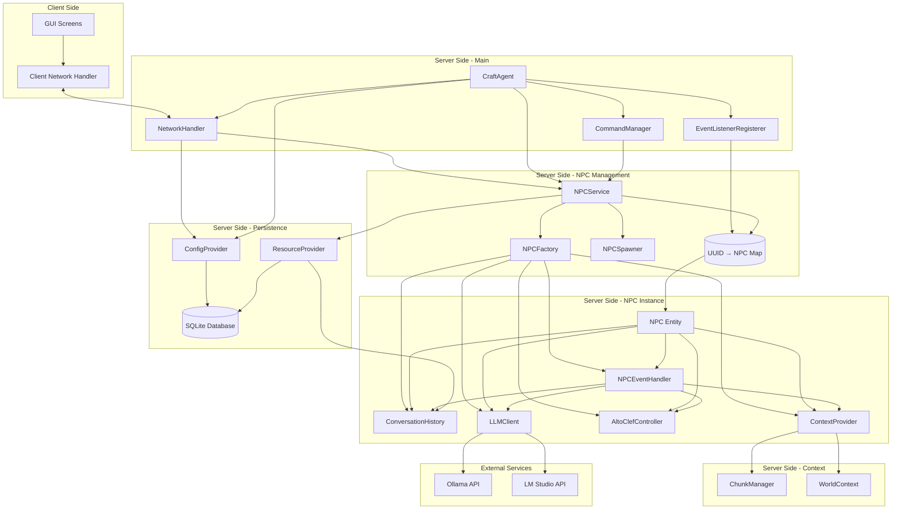

---

## NPC Lifecycle

### Creation Flow

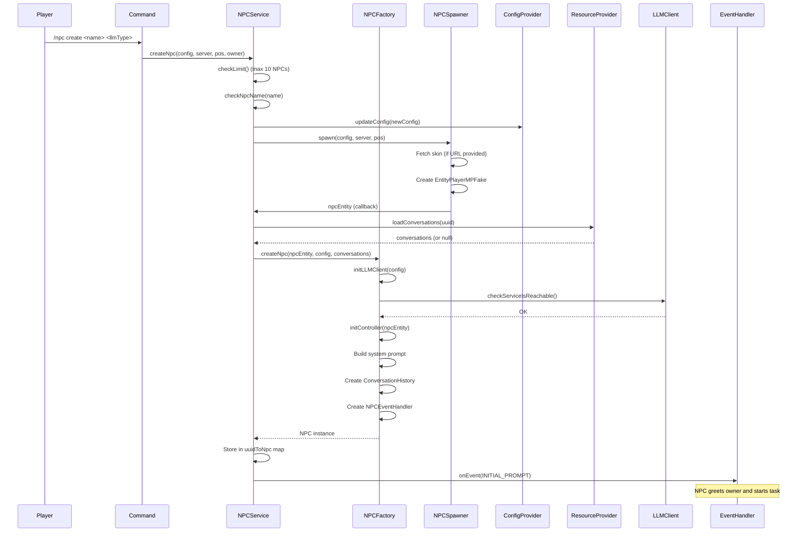

### Removal Flow

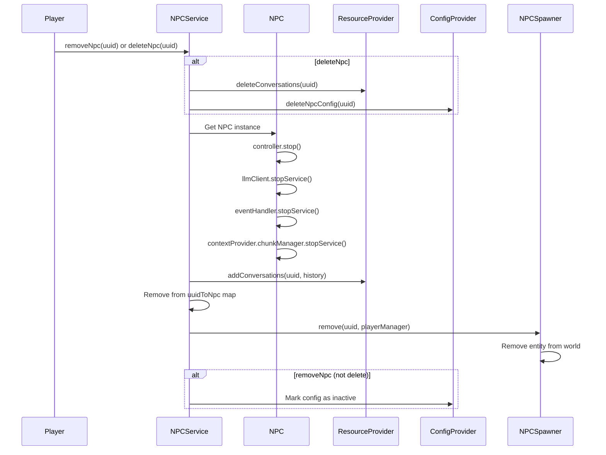

---

## Event Processing Flow

### Chat Message Processing

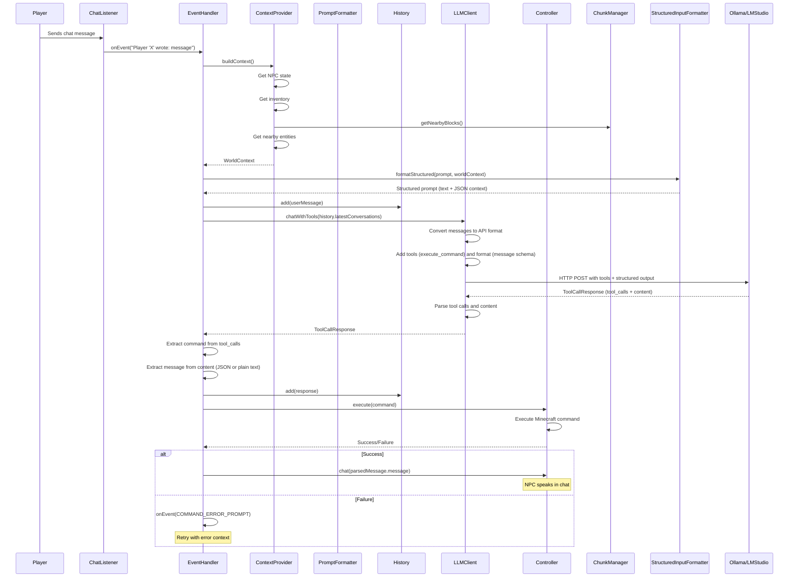

### LLM Response Format

The LLM responds with tool calls and/or structured output:

**With Tool Call + Message**:
```json
{
  "tool_calls": [
    {
      "id": "call_123",
      "type": "function",
      "function": {
        "name": "execute_command",
        "arguments": "{\"command\": \"mine stone\"}"
      }
    }
  ],
  "content": "{\"message\": \"I'll gather some stone!\"}"
}
```

**With Tool Call Only**:
```json
{
  "tool_calls": [...],
  "content": ""
}
```

**With Message Only**:
```json
{
  "content": "{\"message\": \"I'm waiting for instructions.\"}"
}
```

- **tool_calls**: Array of tool calls (commands are executed via `execute_command` tool)
- **content**: Structured JSON with `message` field, or plain text
- **command**: Extracted from tool call arguments
- **message**: Extracted from content (JSON or plain text)

---

## LLM Integration

### LLM Client Interface

```java
public interface LLMClient {
    ToolCallResponse chatWithTools(List<Message> messages);
    void checkServiceIsReachable();
    void stopService();
}
```

**Note**: The legacy `chat()` method has been removed. All LLM interactions now use `chatWithTools()` which supports both tool calling and structured output.

### Supported LLM Types

1. **Ollama**
   - Endpoint: `/api/chat`
   - Direct HTTP client implementation
   - Handles unknown JSON fields gracefully
   - Health check: `/api/tags`
   - **Tool Calling**: Uses `tools` parameter for command execution
   - **Structured Output**: Uses `format` parameter for message responses
   - **Temperature**: Set to 0 for deterministic outputs

2. **LM Studio**
   - OpenAI-compatible API
   - Endpoint: `/v1/chat/completions`
   - Uses OpenAI SDK message format
   - Health check: `/health`
   - **Tool Calling**: Uses `tools` parameter for command execution
   - **Structured Output**: Uses `response_format: {type: "json_object"}` for message responses
   - **Temperature**: Set to 0 for deterministic outputs

### Message Conversion

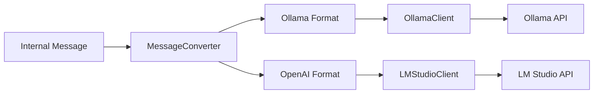

**Internal Message Format**:
```kotlin
data class Message(
    val message: String,
    val role: String  // "system", "user", "assistant"
)
```

**Ollama Format**:
```json
{
  "role": "user",
  "content": "message text"
}
```

**OpenAI Format** (LM Studio):
```json
{
  "role": "user",
  "content": "message text"
}
```

### Hybrid Approach: Tool Calls + Structured Output

The mod uses a hybrid approach for LLM interactions:

**Tool Calls for Commands (Actions)**
- Commands are executed via the `execute_command` tool
- Better semantic meaning: model explicitly "calls" a function
- Better validation at API level
- Tool schema validates command format

**Structured Output for Messages (Data)**
- Messages use structured output via `format`/`response_format` parameters
- Simple data, no side effects
- Consistent format enforcement
- Temperature set to 0 for deterministic outputs

**Response Format**:
```json
{
  "tool_calls": [
    {
      "id": "call_123",
      "type": "function",
      "function": {
        "name": "execute_command",
        "arguments": "{\"command\": \"mine stone\"}"
      }
    }
  ],
  "content": "{\"message\": \"I'll gather some stone!\"}"
}
```

### System Prompt Structure

The system prompt includes:
1. **Character Definition**: NPC name and personality traits
2. **Behavior Guidelines**: How to act in Minecraft
3. **Tool Calling Instructions**: How to use `execute_command` tool
4. **Structured Output Rules**: Message format requirements
5. **Available Commands**: List of all AltoClef commands with descriptions

---

## Context Management

### World Context Structure

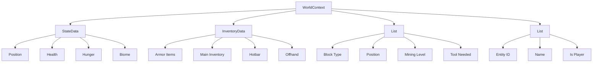

### ChunkManager Block Scanning

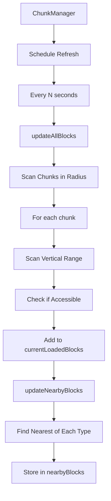

**Configuration**:
- `chunkRadius`: How many chunks to scan (default: 4-7)
- `verticalScanRange`: Y-axis range (default: 8-16)
- `chunkExpiryTime`: Refresh interval in seconds (default: 60-120)

### Structured Input Formatting

The `StructuredInputFormatter` converts `WorldContext` into structured input with **text prompt + JSON context**:

```
{user prompt}

=== CONTEXT DATA (JSON) ===
{
  "state": {
    "position": {"x": 100, "y": 64, "z": 200},
    "health": 20.0,
    "food": 20,
    "biome": "plains"
  },
  "inventory": {
    "hotbar": [{"type": "wooden_pickaxe", "count": 1, "slot": 0}],
    "mainInventory": [...],
    "armor": [...],
    "offHand": [...]
  },
  "nearbyBlocks": [
    {
      "type": "stone",
      "position": {"x": 101, "y": 64, "z": 200},
      "mineLevel": "wood",
      "toolNeeded": "pickaxe"
    }
  ],
  "nearbyEntities": [
    {"id": 123, "name": "zombie", "isPlayer": false}
  ]
}
=== END CONTEXT ===
```

**Benefits**:
- Structured data: Context is proper JSON, not text
- Easier parsing: LLMs can parse JSON more reliably
- Clear separation: Text instructions vs. structured data
- Type safety: JSON structure enforces data types

**Legacy Support**: Falls back to old `PromptFormatter.format()` if JSON serialization fails.

---

## Database & Persistence

### Database Schema

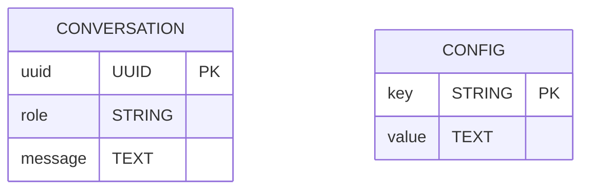

### Conversation Persistence Flow

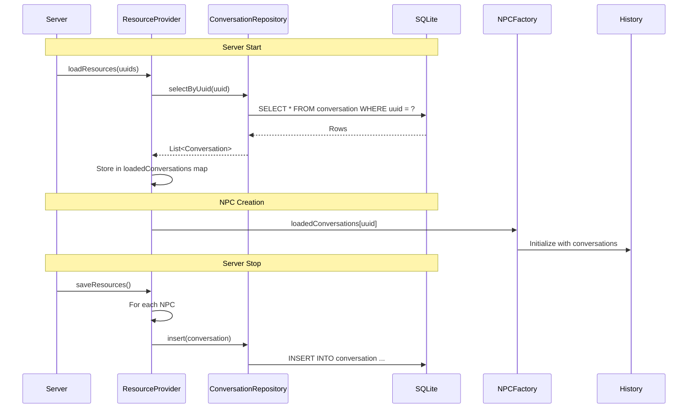

### Configuration Persistence

- **BaseConfig**: Stored in `config/craftagent/base.json`
- **NPCConfig**: Stored in `config/craftagent/npcs/{uuid}.json`
- Saved on server stop or config update
- Loaded on server start

---

## Networking

### Network Architecture

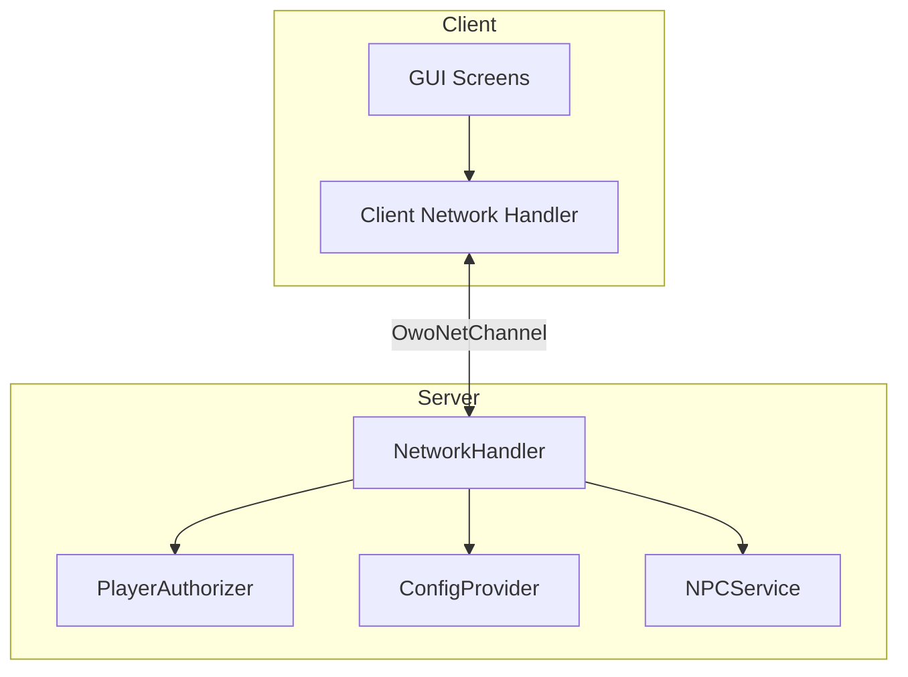

### Packet Types

1. **ConfigPacket** (Server → Client)
   - Sends current configs to client for GUI display

2. **UpdateBaseConfigPacket** (Client → Server)
   - Updates global settings

3. **UpdateNpcConfigPacket** (Client → Server)
   - Updates specific NPC settings

4. **CreateNpcPacket** (Client → Server)
   - Creates new NPC

5. **DeleteNpcPacket** (Client → Server)
   - Removes or deletes NPC

6. **STTPacket** (Client → Server)
   - Speech-to-text control (if implemented)

### Authorization

All serverbound packets are checked by `PlayerAuthorizer`:
- Verifies player has permission
- Some packets require local connection only

---

## Configuration System

### BaseConfig

Global settings affecting all NPCs:

| Setting | Default | Range | Description |
|---------|---------|-------|-------------|
| `llmTimeout` | 10 | 1-300 | LLM API timeout in seconds |
| `contextChunkRadius` | 4 | 1-7 | Chunks to scan around NPC |
| `contextVerticalScanRange` | 8 | 4-16 | Vertical scan range (Y-axis) |
| `chunkExpiryTime` | 60 | 20-120 | Block cache refresh interval |
| `verbose` | false | - | Debug mode |

### NPCConfig

Per-NPC settings:

| Setting | Description |
|---------|-------------|
| `npcName` | NPC's display name |
| `uuid` | Unique identifier |
| `llmType` | `OLLAMA` or `LM_STUDIO` |
| `llmModel` | Model name (e.g., "llama3", "gpt-4") |
| `llmCharacter` | Personality traits/prompt |
| `ollamaUrl` | Ollama server URL (default: `http://localhost:11434`) |
| `lmStudioUrl` | LM Studio URL (default: `http://localhost:1234/v1`) |
| `skinUrl` | Optional custom skin URL |
| `isActive` | Whether NPC is currently spawned |

### Configuration Flow

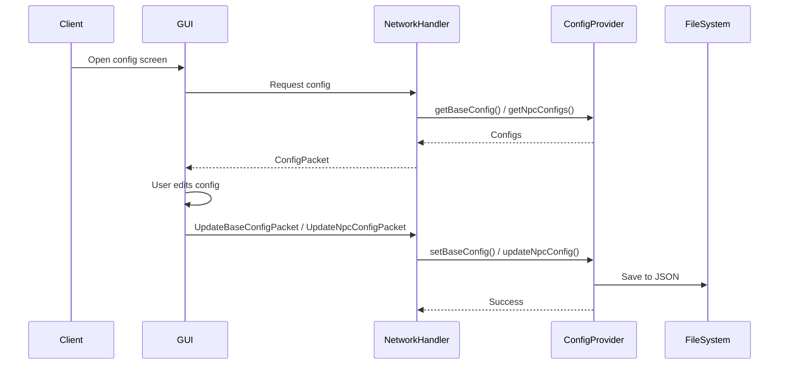

---

## Key Design Patterns

### 1. **Factory Pattern**
- `NPCFactory`: Creates NPC instances with all dependencies

### 2. **Service Pattern**
- `NPCService`: Manages NPC lifecycle
- `ResourceProvider`: Manages data persistence

### 3. **Repository Pattern**
- `ConversationRepository`: Abstracts database access

### 4. **Observer Pattern**
- Event listeners for chat messages, NPC events

### 5. **Strategy Pattern**
- `LLMClient` interface with multiple implementations (Ollama, LM Studio)

### 6. **Builder Pattern**
- `NPCConfig.builder()` for configuration creation

---

## Threading Model

### Async Operations

1. **NPC Creation**: `CompletableFuture.runAsync()` in `NPCService`
2. **Event Processing**: `CompletableFuture.runAsync()` in `NPCEventHandler`
3. **Block Scanning**: `ScheduledExecutorService` in `ChunkManager`
4. **Database Operations**: `ExecutorService` in `ResourceProvider`

### Thread Safety

- `uuidToNpc`: `ConcurrentHashMap` for thread-safe access
- `ConversationHistory.add()`: `@Synchronized` for thread safety
- `ContextProvider.buildContext()`: `synchronized` block
- `ChunkManager`: `synchronized` for block updates

---

## Error Handling

### Exception Types

1. **LLMServiceException**: LLM API errors
2. **NPCCreationException**: NPC creation failures
3. **CustomEventException**: Event processing errors

### Error Recovery

- LLM errors: Logged, user notified via chat
- Command errors: Retry with error context
- JSON parsing errors: Attempt cleanup (remove markdown), then fail gracefully

---

## Performance Considerations

### Optimization Strategies

1. **Block Caching**: ChunkManager caches blocks, refreshes periodically
2. **Conversation Summarization**: Old messages summarized when history exceeds 30
3. **Async Processing**: LLM calls and heavy operations run asynchronously
4. **Limited History**: Maximum 30 messages to reduce token usage

### Resource Limits

- Maximum 10 concurrent NPCs
- Conversation history: 30 messages (then summarization)
- Block scan radius: Configurable (default 4-7 chunks)
- LLM timeout: 1-300 seconds (configurable)

---

## Extension Points

### Adding New LLM Provider

1. Create new class implementing `LLMClient`
2. Add `LLMType` enum value
3. Update `NPCFactory.initLLMClient()` to instantiate new client
4. Add configuration fields in `NPCConfig` if needed
5. Update GUI to show new option

### Adding New Event Types

1. Create event listener implementing `IEventListener`
2. Register in `EventListenerRegisterer`
3. Call `npc.eventHandler.onEvent()` with formatted prompt

### Custom Commands

Commands are provided by AltoClef controller. To add new commands:
1. Extend AltoClef command system
2. Commands automatically appear in system prompt
3. LLM can use new commands in responses

---

## Conclusion

The CraftAgent mod architecture is designed for:
- **Modularity**: Clear separation of concerns
- **Extensibility**: Easy to add new LLM providers or features
- **Performance**: Async operations and caching
- **Reliability**: Error handling and persistence
- **Maintainability**: Well-organized code structure

This architecture enables AI-powered NPCs that can autonomously interact with the Minecraft world while maintaining conversation context and world awareness.

