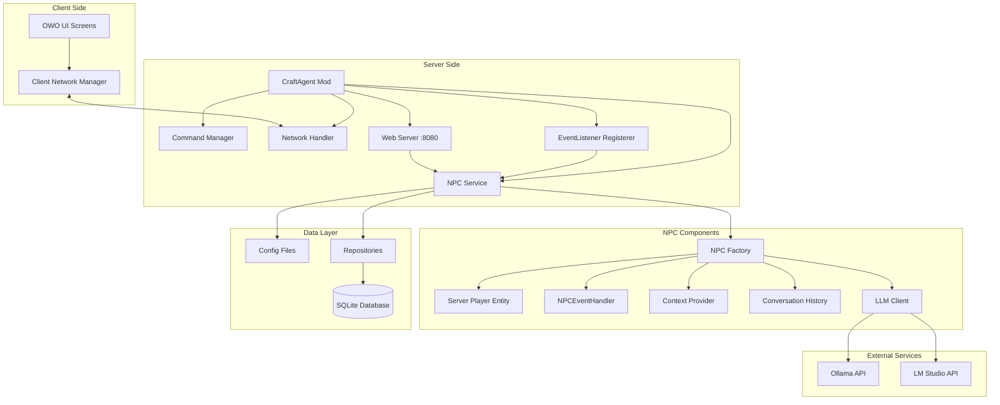
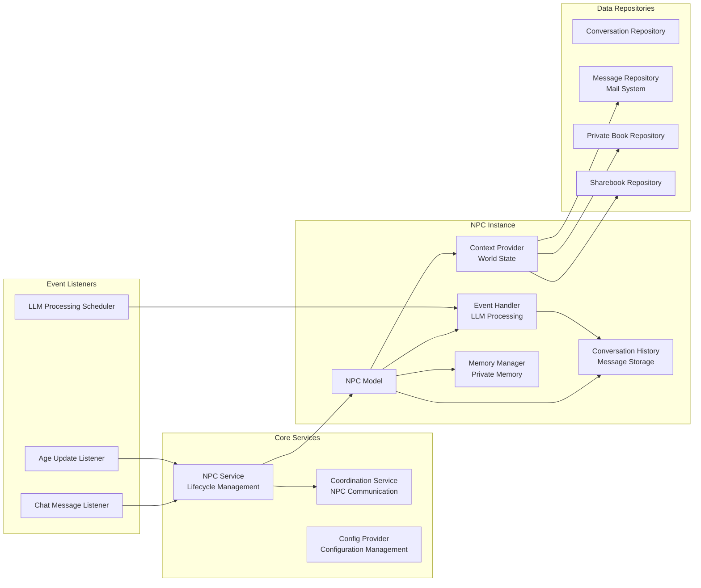
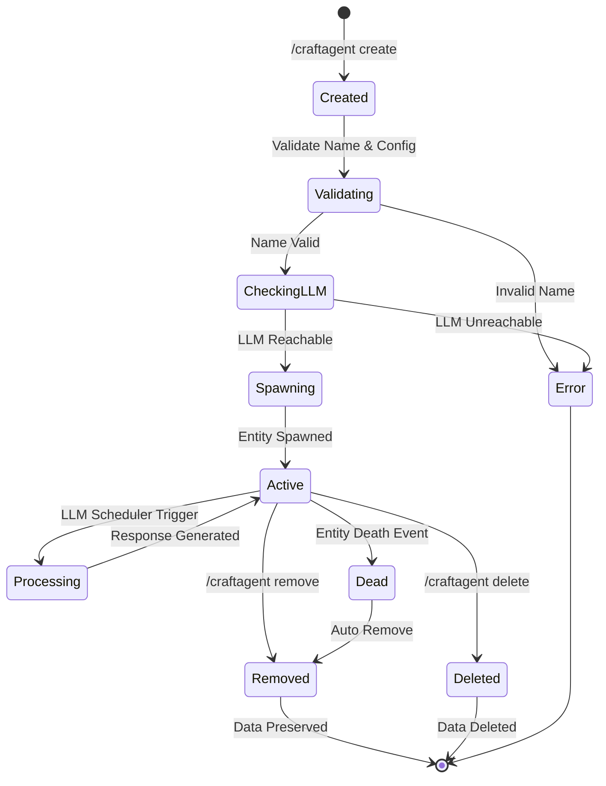
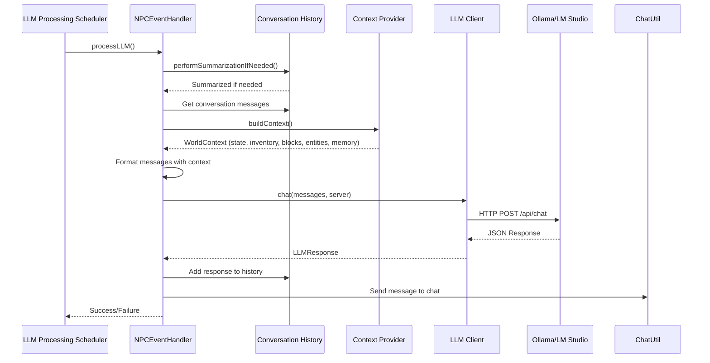
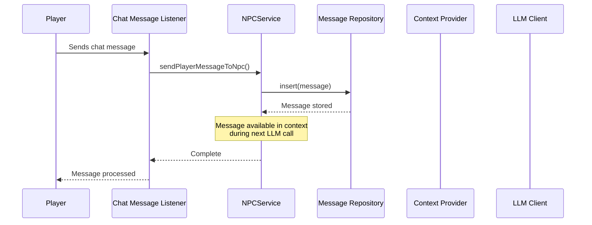
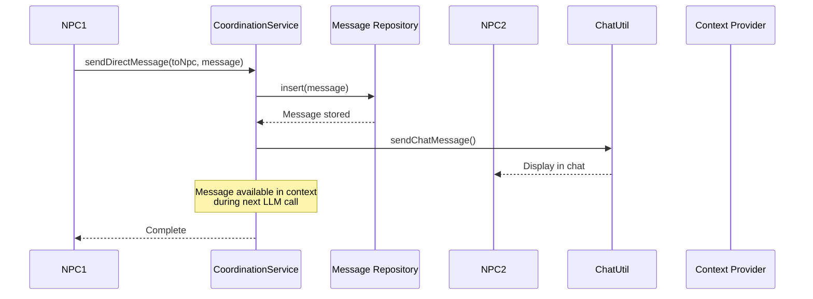
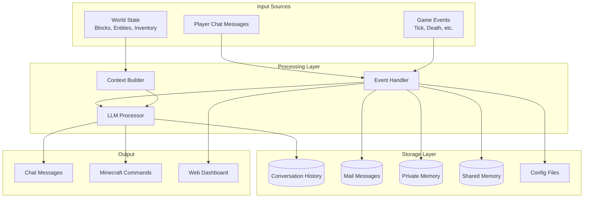
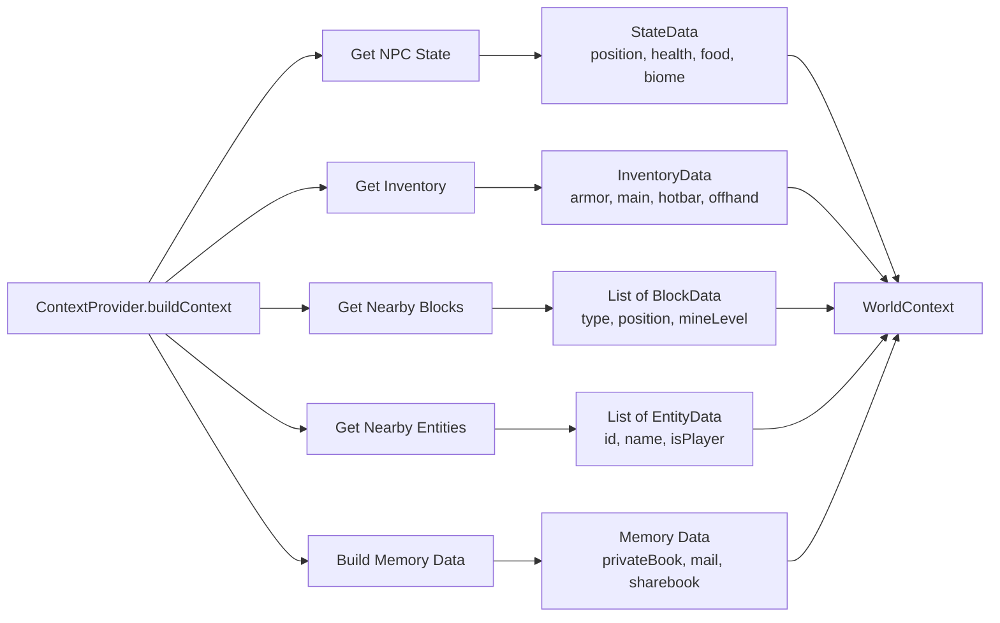
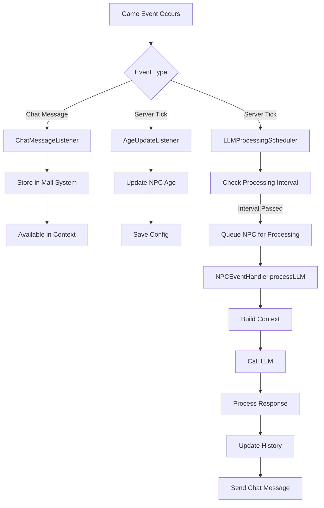

# CraftAgent

A Minecraft Fabric mod that brings intelligent AI-powered NPCs to your world. NPCs use Large Language Models (LLMs) to understand context, make decisions, and interact with players.

## Features

- 🤖 **AI-Powered NPCs**: Uses LLMs (Ollama, LM Studio) for intelligent decision-making
- 🎮 **Autonomous Actions**: NPCs execute Minecraft commands to interact with the world
- 💬 **Conversation Memory**: Persistent conversation history in SQLite
- 🌍 **World Context Awareness**: NPCs understand surroundings (blocks, entities, inventory)
- 🔧 **Multi-LLM Support**: Ollama and LM Studio (OpenAI-compatible)
- 🎨 **Client-Server Architecture**: GUI configuration on client, NPC logic on server
- 🛠️ **Command System**: Uses Brigadier to discover and execute all Minecraft commands
- 🌐 **Web Dashboard**: Built-in web UI (http://localhost:8080) to monitor NPCs, view context, messages, and memory
- 📧 **Mail System**: NPCs can send and receive messages via mail system
- 🧠 **Memory System**: Private and shared memory (privateBook, sharebook) for persistent knowledge

## Requirements

- **Minecraft**: 1.20.1 or 1.21.8
- **Java**: 17 (1.20.1) or 21 (1.21.8+)
- **Fabric Loader**: 0.17.3+
- **LLM Service**: Ollama or LM Studio running locally

## Installation

### For Players

1. Download the latest JAR from [Modrinth](https://modrinth.com/mod/craftagent) or [CurseForge](https://www.curseforge.com/minecraft/mc-mods/craftagent)
2. Place the JAR in your `mods` folder
3. Install and start either:
   - **Ollama**: Download from [ollama.ai](https://ollama.ai) and run `ollama serve`
   - **LM Studio**: Download from [lmstudio.ai](https://lmstudio.ai) and start the server
4. Launch Minecraft and enjoy!

### For Developers

1. Clone the repository:
   ```bash
   git clone https://github.com/prskid1000/CraftAgent.git
   cd CraftAgent
   ```

2. Build the project:
   ```bash
   # Windows
   .\gradlew.bat :1.21.8:build
   
   # Linux/Mac
   ./gradlew :1.21.8:build
   ```

3. Find the compiled JAR in `versions/1.21.8/build/libs/`

## Building

```bash
# Build for specific version
.\gradlew.bat :1.21.8:build

# Build all versions
.\gradlew.bat build

# Run in development
.\gradlew.bat :1.21.8:runServer
```

## Usage

### Commands

- `/craftagent` - Open configuration GUI
- `/craftagent create <name> <llmType>` - Create new NPC
- `/craftagent remove <name>` - Remove NPC (keeps data)
- `/craftagent delete <name>` - Permanently delete NPC

### Web Dashboard

CraftAgent includes a built-in web dashboard for monitoring NPCs in real-time. The dashboard automatically starts when the Minecraft server starts.

**Access the Dashboard:**
1. Start your Minecraft server with CraftAgent installed
2. Open your web browser and navigate to: **http://localhost:8080**
3. The dashboard will display all active NPCs with their current status

**Dashboard Features:**
- **NPC Overview**: View all NPCs with their basic information (name, age, gender, health, food, position)
- **State Tab**: Real-time statistics with progress bars for health and food, position coordinates, and biome information
- **Context Tab**: Detailed world context including:
  - State information (position, health, food, biome)
  - Inventory details (hotbar, main inventory, armor, off-hand)
  - Nearby blocks table (type, position, mine level, tool needed)
  - Nearby entities table (name, type, ID, player status)
- **Messages Tab**: Conversation history with role badges and timestamps
- **Mail Tab**: Mail messages from other NPCs and players
- **Memory Tab**: NPC's persistent memory including:
  - Private book pages (NPC-specific memory)
  - Shared book pages (accessible to all NPCs)

**Note:** The dashboard auto-refreshes every 5 minutes. Use the refresh button in the NPC detail modal to manually update data.

### Creating an NPC

1. Start your LLM service (Ollama or LM Studio)
2. Use `/craftagent create <name> <llmType>` or open GUI with `/craftagent`
3. Configure the NPC:
   - **Name**: Display name
   - **LLM Type**: `ollama` or `lm_studio`
   - **Model**: Model name (e.g., `llama3`)
   - **URL**: LLM service URL (defaults: `http://localhost:11434` for Ollama, `http://localhost:1234/v1` for LM Studio)

## LLM Setup

### Ollama

1. Install from [ollama.ai](https://ollama.ai)
2. Start: `ollama serve`
3. Pull a model: `ollama pull llama3`
4. Configure NPC: LLM Type `ollama`, Model `llama3`, URL `http://localhost:11434`

### LM Studio

1. Install from [lmstudio.ai](https://lmstudio.ai)
2. Download a model and start local server (port 1234)
3. Configure NPC: LLM Type `lm_studio`, Model name, URL `http://localhost:1234/v1`

## Architecture

### System Architecture Overview



### Component Architecture



### NPC Lifecycle Flow



### LLM Processing Flow



### Message Flow: Player → NPC



### Message Flow: NPC → NPC



### Data Flow Architecture



## Component Reference Tables

### Core Components

| Component | Package | Responsibility | Key Methods |
|-----------|---------|----------------|-------------|
| **CraftAgent** | `me.prskid1000.craftagent` | Main mod initializer | `onInitialize()`, `onStop()` |
| **NPCService** | `me.prskid1000.craftagent.common` | NPC lifecycle management | `createNpc()`, `removeNpc()`, `deleteNpc()` |
| **NPCFactory** | `me.prskid1000.craftagent.common` | NPC instance creation | `createNpc()` |
| **NPCEventHandler** | `me.prskid1000.craftagent.event` | Event processing & LLM calls | `updateState()`, `processLLM()` |
| **ContextProvider** | `me.prskid1000.craftagent.context` | World context gathering | `buildContext()` |
| **ConversationHistory** | `me.prskid1000.craftagent.history` | Message history management | `add()`, `performSummarizationIfNeeded()` |
| **CoordinationService** | `me.prskid1000.craftagent.coordination` | Inter-NPC communication | `sendDirectMessage()` |

### Event Listeners

| Listener | Package | Event Type | Purpose |
|----------|---------|------------|---------|
| **ChatMessageListener** | `me.prskid1000.craftagent.listener` | `ServerMessageEvents.CHAT_MESSAGE` | Routes player messages to NPCs via mail |
| **AgeUpdateListener** | `me.prskid1000.craftagent.listener` | `ServerTickEvents.END_SERVER_TICK` | Updates NPC age over time |
| **LLMProcessingScheduler** | `me.prskid1000.craftagent.listener` | `ServerTickEvents.END_SERVER_TICK` | Schedules LLM processing for NPCs |
| **EventListenerRegisterer** | `me.prskid1000.craftagent.listener` | - | Registers all event listeners |

### Data Models

| Model | Package | Description | Key Fields |
|-------|---------|-------------|------------|
| **NPC** | `me.prskid1000.craftagent.model` | Main NPC data structure | `entity`, `llmClient`, `history`, `eventHandler`, `contextProvider`, `config` |
| **ConversationMessage** | `me.prskid1000.craftagent.history` | Conversation history message | `message`, `role`, `timestamp` |
| **Message** | `me.prskid1000.craftagent.model.database` | Mail system message | `senderUuid`, `recipientUuid`, `content`, `read` |
| **WorldContext** | `me.prskid1000.craftagent.model.context` | World state snapshot | `state`, `inventory`, `nearbyBlocks`, `nearbyEntities`, `memoryData` |
| **ContextData** | `me.prskid1000.craftagent.model.context` | Context data structures | `BlockData`, `EntityData`, `ItemData`, `InventoryData`, `StateData` |

### Repositories

| Repository | Package | Purpose | Key Methods |
|------------|---------|---------|-------------|
| **ConversationRepository** | `me.prskid1000.craftagent.database.repositories` | Conversation history storage | `insert()`, `selectByUuid()` |
| **MessageRepository** | `me.prskid1000.craftagent.database.repositories` | Mail system storage | `insert()`, `selectByRecipient()`, `markAsRead()` |
| **PrivateBookPageRepository** | `me.prskid1000.craftagent.database.repositories` | NPC-specific memory | `insert()`, `selectByUuid()` |
| **SharebookRepository** | `me.prskid1000.craftagent.database.repositories` | Shared memory across NPCs | `insert()`, `selectAll()` |

### LLM Clients

| Client | Package | LLM Type | API Endpoint |
|--------|---------|----------|--------------|
| **OllamaClient** | `me.prskid1000.craftagent.llm.ollama` | Ollama | `/api/chat` |
| **LMStudioClient** | `me.prskid1000.craftagent.llm.lmstudio` | LM Studio | `/chat/completions` |
| **LLMClient** | `me.prskid1000.craftagent.llm` | Interface | - |

### Configuration

| Config | Package | File Location | Purpose |
|--------|---------|--------------|---------|
| **BaseConfig** | `me.prskid1000.craftagent.config` | `config/craftagent/base.json` | Global settings (timeout, chunk radius, etc.) |
| **NPCConfig** | `me.prskid1000.craftagent.config` | `config/craftagent/npcs/{uuid}.json` | Per-NPC settings (name, LLM type, model, etc.) |
| **ConfigProvider** | `me.prskid1000.craftagent.config` | - | Configuration management |

## Data Flow Details

### Context Building Process



### Memory System Structure

| Memory Type | Repository | Scope | Access Pattern |
|-------------|------------|-------|----------------|
| **Conversation History** | ConversationRepository | Per-NPC | Loaded on spawn, saved on shutdown |
| **Mail Messages** | MessageRepository | Per-NPC | Stored when received, marked read when accessed |
| **Private Memory** | PrivateBookPageRepository | Per-NPC | NPC-specific notes and knowledge |
| **Shared Memory** | SharebookRepository | Global | Accessible to all NPCs |

### Event Processing Flow



## Configuration

Config files are in `config/craftagent/`:

- **base.json**: Global settings (timeout, chunk radius, debug mode)
- **npcs/{uuid}.json**: Per-NPC settings (name, LLM type, model, personality)

### Base Config Fields

| Field | Type | Default | Description |
|-------|------|---------|-------------|
| `llmTimeout` | int | 30 | LLM request timeout in seconds |
| `contextChunkRadius` | int | 2 | Chunk scan radius for context |
| `contextVerticalScanRange` | int | 16 | Vertical block scan range |
| `maxNearbyBlocks` | int | 50 | Maximum blocks in context |
| `maxNearbyEntities` | int | 10 | Maximum entities in context |
| `llmProcessingInterval` | int | 5 | Seconds between LLM processing cycles |
| `llmMinInterval` | int | 2 | Minimum seconds between NPC processing |
| `conversationHistoryLength` | int | 5 | Max conversation messages before summarization |

### NPC Config Fields

| Field | Type | Default | Description |
|-------|------|---------|-------------|
| `npcName` | String | "Steve" | Display name |
| `uuid` | UUID | random | Unique identifier |
| `isActive` | boolean | true | Whether NPC is active |
| `llmType` | LLMType | LM_STUDIO | LLM provider type |
| `llmModel` | String | - | Model name |
| `ollamaUrl` | String | "http://localhost:11434" | Ollama API URL |
| `lmStudioUrl` | String | "http://localhost:1234/v1" | LM Studio API URL |
| `age` | int | 20 | NPC age in years |
| `gender` | String | "neutral" | Gender (male/female/neutral) |
| `customSystemPrompt` | String | "" | Custom system prompt override |

## Development

### Key Components

- **NPCService**: Manages NPC lifecycle (create, remove, delete, spawn)
- **NPCEventHandler**: Processes events and LLM interactions
- **ContextProvider**: Gathers world state information (blocks, entities, inventory)
- **MinecraftCommandUtil**: Discovers and executes Minecraft commands via Brigadier
- **LLMClient**: Interface for LLM providers (Ollama, LM Studio)
- **CoordinationService**: Handles inter-NPC communication via mail system
- **WebServer**: HTTP server for monitoring NPCs via web dashboard

### Package Structure

```
me.prskid1000.craftagent/
├── auth/              # Player authorization
├── callback/          # Event callbacks
├── client/            # Client-side code (GUI, networking)
├── commands/          # Minecraft commands
├── common/            # Core services (NPCService, NPCFactory)
├── config/            # Configuration management
├── constant/          # Constants and instructions
├── context/           # World context gathering
├── coordination/      # Inter-NPC communication
├── database/           # Data persistence
│   ├── repositories/  # Database repositories
│   └── resources/     # Resource providers
├── event/             # Event handling
├── exception/         # Exception classes
├── history/           # Conversation history
├── listener/          # Event listeners
├── llm/               # LLM client implementations
│   ├── lmstudio/      # LM Studio client
│   └── ollama/        # Ollama client
├── memory/            # Memory management
├── mineskin/          # Skin management
├── mixin/             # Mixins for Minecraft
├── model/             # Data models
│   ├── context/       # Context data structures
│   └── database/      # Database models
├── networking/        # Network packets
├── thread/            # Thread management
├── util/              # Utility classes
└── web/               # Web server
```

## Troubleshooting

- **NPC not responding**: Check LLM service is running, verify URL/model in config
- **Commands not working**: Check server logs, ensure NPC has required permissions
- **LLM timeout**: Increase `llmTimeout` in base config or try a faster model
- **Mail not working**: Verify MessageRepository is initialized and NPC UUID is correct
- **Context not updating**: Check ChunkManager is running and chunks are loaded

## Contributing

Contributions welcome! Fork, create a feature branch, and submit a pull request.

## License

This project is licensed under LGPL-3.0.

## Links

- [Modrinth](https://modrinth.com/mod/craftagent)
- [CurseForge](https://www.curseforge.com/minecraft/mc-mods/craftagent)
- [GitHub](https://github.com/prskid1000/CraftAgent)

## Credits

- **Author**: prskid1000
- **Fabric**: Mod loader framework
- **Brigadier**: Command system (Mojang)
- **Ollama** & **LM Studio**: LLM providers
