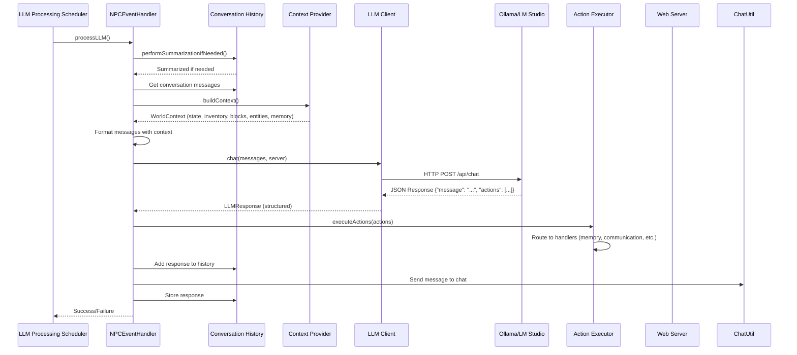
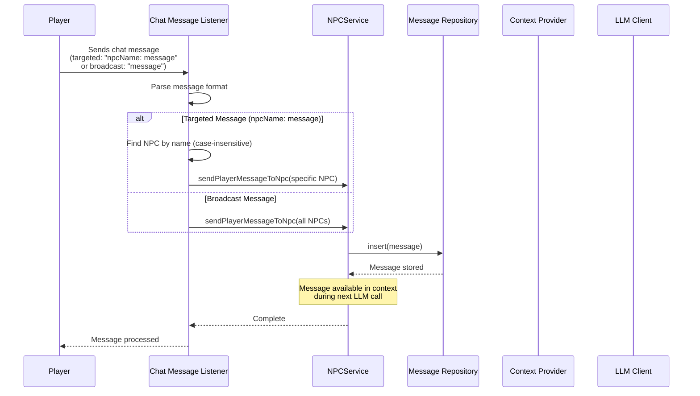
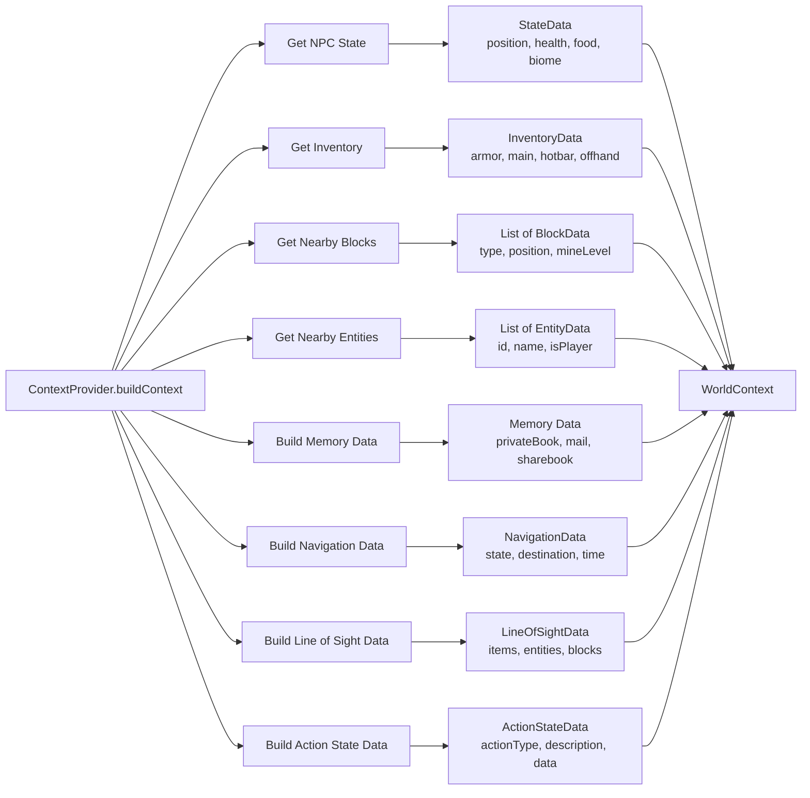
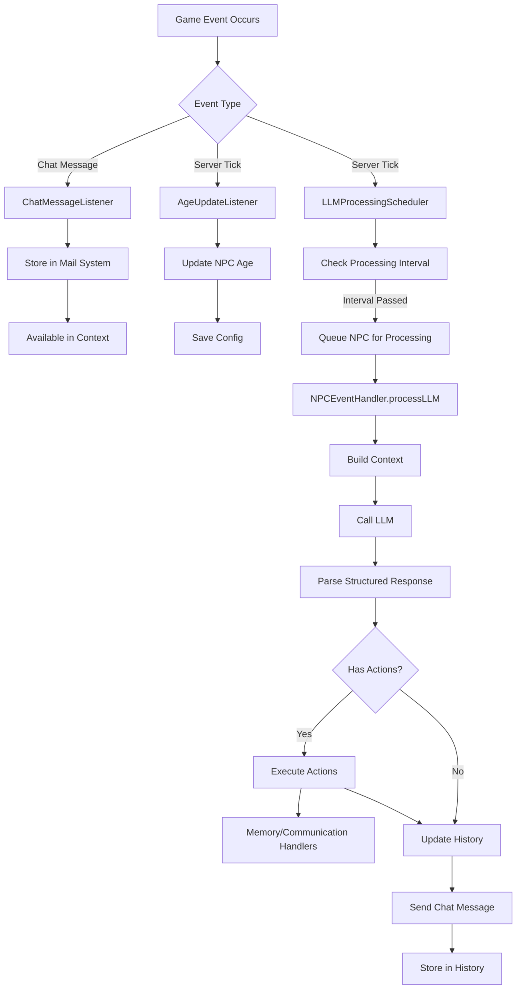

# CraftAgent

A Minecraft Fabric mod that brings intelligent AI-powered NPCs to your world. NPCs use Large Language Models (LLMs) to understand context, make decisions, and interact with players.

## Features

- 🤖 **AI-Powered NPCs**: Uses LLMs (Ollama, LM Studio) for intelligent decision-making
- 🎮 **Autonomous Actions**: NPCs execute Minecraft commands to interact with the world
- 💬 **Conversation Memory**: Persistent conversation history in SQLite
- 🌍 **World Context Awareness**: NPCs understand surroundings (blocks, entities, inventory, navigation, line of sight)
- 🔧 **Multi-LLM Support**: Ollama and LM Studio (OpenAI-compatible)
- 🎨 **Client-Server Architecture**: GUI configuration on client, NPC logic on server
- 🛠️ **Command System**: Uses Brigadier to discover and execute all Minecraft commands
- 🌐 **Web Dashboard**: Built-in web UI (http://localhost:8080) with auto-refresh based on LLM processing intervals
- 📧 **Mail System**: NPCs can send and receive messages via mail system
- 💬 **Targeted Chat Messages**: Send messages to specific NPCs using "npcName: message" format, or broadcast to all NPCs
- 🧠 **Memory System**: Private and shared memory (privateBook, sharebook) for persistent knowledge
- ⚡ **Structured Actions**: LLM returns structured output with messages and executable actions
- 🔄 **Real-Time Updates**: Web UI automatically updates without manual refresh
- 🧭 **Navigation System**: NPCs can travel to coordinates, entities, or blocks with state tracking
- 👁️ **Line of Sight Detection**: NPCs detect items, entities, and blocks in their line of sight
- ⚡ **Action State Management**: Track current actions (mining, building, crafting, hunting, farming, fishing, combat)
- 🛠️ **Advanced Actions**: Mining, building, crafting, hunting, farming, fishing, and combat actions

## Requirements

- **Minecraft**: 1.20.1 or 1.21.8
- **Java**: 17 (1.20.1) or 21 (1.21.8+)
- **Fabric Loader**: 0.17.3+
- **LLM Service**: Ollama or LM Studio running locally

## Installation

### For Players

1. Download the latest JAR from [Modrinth](https://modrinth.com/mod/craftagent) or [CurseForge](https://www.curseforge.com/minecraft/mc-mods/craftagent)
2. Place the JAR in your `mods` folder
3. Install and start either:
   - **Ollama**: Download from [ollama.ai](https://ollama.ai) and run `ollama serve`
   - **LM Studio**: Download from [lmstudio.ai](https://lmstudio.ai) and start the server
4. Launch Minecraft and enjoy!

### For Developers

1. Clone the repository:
   ```bash
   git clone https://github.com/prskid1000/CraftAgent.git
   cd CraftAgent
   ```

2. Build the project:
   ```bash
   # Windows
   .\gradlew.bat :1.21.8:build
   
   # Linux/Mac
   ./gradlew :1.21.8:build
   ```

3. Find the compiled JAR in `versions/1.21.8/build/libs/`

## Building

```bash
# Build for specific version
.\gradlew.bat :1.21.8:build

# Build all versions
.\gradlew.bat build

# Run in development
.\gradlew.bat :1.21.8:runServer
```

## Usage

### Commands

- `/craftagent` - Open configuration GUI
- `/craftagent add <name> <llmType>` - Create new NPC
- `/craftagent remove <name>` - Remove NPC (keeps data)
- `/craftagent <npcName> <action>` - Execute action on specified NPC (case-insensitive NPC name)
  - Example: `/craftagent steve mail send alice "Hello there"`
  - Example: `/craftagent Steve sharedbook add location "Iron mine at 150, 64, -200"`

### Chat Messages

Players can send messages to NPCs via chat. Messages are automatically routed to NPCs:

- **Targeted Messages**: `steve: Do your homework` - Sends message only to NPC named "steve" (case-insensitive)
- **Broadcast Messages**: `Do your homework` - Sends message to all NPCs

NPC names are matched case-insensitively, so `steve`, `STEVE`, and `Steve` all match the same NPC.

### Web Dashboard

CraftAgent includes a built-in web dashboard for monitoring NPCs in real-time. The dashboard automatically starts when the Minecraft server starts.

**Access the Dashboard:**
1. Start your Minecraft server with CraftAgent installed
2. Open your web browser and navigate to: **http://localhost:8080**
3. The dashboard will display all active NPCs with their current status

**Dashboard Features:**
- **NPC Overview**: View all NPCs with their basic information (name, age, gender, health, food, position, current action, navigation state)
- **State Tab**: Real-time statistics with progress bars for health and food, position coordinates, and biome information
- **Context Tab**: Detailed world context including:
  - State information (position, health, food, biome)
  - Inventory details (hotbar, main inventory, armor, off-hand)
  - Nearby blocks table (type, position, mine level, tool needed)
  - Nearby entities table (name, type, ID, player status)
  - Navigation state (current state, destination, time in state)
  - Current action (action type, description, duration, action-specific data)
  - Line of sight data:
    - Items in line of sight (type, count, position, distance)
    - Entities in line of sight (name, type, ID, player status)
    - Target block (where NPC is looking)
    - Visible blocks (blocks visible in line of sight)
- **Messages Tab**: Conversation history with role badges and timestamps
- **Mail Tab**: Mail messages from other NPCs and players
- **Memory Tab**: NPC's persistent memory including:
  - Private book pages (NPC-specific memory)
  - Shared book pages (accessible to all NPCs)

**Auto-Refresh:**
- The dashboard uses auto-refresh based on the maximum LLM processing interval
- All data (NPCs, messages, mail, memory) updates automatically at configured intervals
- No manual refresh needed - the UI stays synchronized with the server
- Updates are triggered when:
  - NPCs are created or removed
  - New messages are added to conversation history
  - Mail messages are sent or received
  - Memory (private/shared book) is updated

### Creating an NPC

1. Start your LLM service (Ollama or LM Studio)
2. Use `/craftagent create <name> <llmType>` or open GUI with `/craftagent`
3. Configure the NPC:
   - **Name**: Display name
   - **LLM Type**: `ollama` or `lm_studio`
   - **Model**: Model name (e.g., `llama3`)
   - **URL**: LLM service URL (defaults: `http://localhost:11434` for Ollama, `http://localhost:1234/v1` for LM Studio)

## LLM Setup

### Ollama

1. Install from [ollama.ai](https://ollama.ai)
2. Start: `ollama serve`
3. Pull a model: `ollama pull llama3`
4. Configure NPC: LLM Type `ollama`, Model `llama3`, URL `http://localhost:11434`

### LM Studio

1. Install from [lmstudio.ai](https://lmstudio.ai)
2. Download a model and start local server (port 1234)
3. Configure NPC: LLM Type `lm_studio`, Model name, URL `http://localhost:1234/v1`

## Architecture

### System Architecture Overview


### Component Architecture


### NPC Lifecycle Flow


### LLM Processing Flow



### Message Flow: Player → NPC



### Message Flow: NPC → NPC


### Data Flow Architecture


## Component Reference Tables

### Core Components

| Component | Package | Responsibility | Key Methods |
|-----------|---------|----------------|-------------|
| **CraftAgent** | `me.prskid1000.craftagent` | Main mod initializer | `onInitialize()`, `onStop()` |
| **NPCService** | `me.prskid1000.craftagent.common` | NPC lifecycle management | `createNpc()`, `removeNpc()`, `deleteNpc()` |
| **NPCFactory** | `me.prskid1000.craftagent.common` | NPC instance creation | `createNpc()` |
| **NPCEventHandler** | `me.prskid1000.craftagent.event` | Event processing & LLM calls | `updateState()`, `processLLM()` |
| **ContextProvider** | `me.prskid1000.craftagent.context` | World context gathering | `buildContext()` |
| **ConversationHistory** | `me.prskid1000.craftagent.history` | Message history management | `add()`, `performSummarizationIfNeeded()` |
| **CoordinationService** | `me.prskid1000.craftagent.coordination` | Inter-NPC communication | `sendDirectMessage()` |
| **ActionProvider** | `me.prskid1000.craftagent.action` | Routes actions to handlers | `executeAction()`, `isValidAction()` |
| **ActionProviderFactory** | `me.prskid1000.craftagent.action` | Creates ActionProvider with all handlers | `create()` |
| **ActionExecutor** | `me.prskid1000.craftagent.action` | Executes LLM-generated actions, parses commands | `executeActions()`, `executeAction()` |
| **ActionParser** | `me.prskid1000.craftagent.action` | Generic command parser with quote support | `parseQuotedArguments()`, `wasArgumentQuoted()` |
| **MemoryActionHandler** | `me.prskid1000.craftagent.action` | Handles memory actions | `handleAction()` (sharedbook/privatebook) |
| **CommunicationActionHandler** | `me.prskid1000.craftagent.action` | Handles communication actions | `handleAction()` (mail send) |
| **NavigationActionHandler** | `me.prskid1000.craftagent.action` | Handles navigation/travel actions | `handleAction()` (travel to coordinates/entity/block) |
| **MiningActionHandler** | `me.prskid1000.craftagent.action` | Handles mining actions | `handleAction()` (mine blocks) |
| **BuildingActionHandler** | `me.prskid1000.craftagent.action` | Handles building/placing actions | `handleAction()` (build/place blocks) |
| **CraftingActionHandler** | `me.prskid1000.craftagent.action` | Handles crafting actions | `handleAction()` (craft items) |
| **HuntingActionHandler** | `me.prskid1000.craftagent.action` | Handles hunting actions | `handleAction()` (hunt mobs) |
| **FarmingActionHandler** | `me.prskid1000.craftagent.action` | Handles farming actions | `handleAction()` (plant/harvest crops) |
| **FishingActionHandler** | `me.prskid1000.craftagent.action` | Handles fishing actions | `handleAction()` (fish/stop fishing) |
| **CombatActionHandler** | `me.prskid1000.craftagent.action` | Handles combat actions | `handleAction()` (attack/defend) |
| **ActionStateManager** | `me.prskid1000.craftagent.context` | Manages current action state | `setAction()`, `getActionDescription()` |
| **NavigationState** | `me.prskid1000.craftagent.context` | Manages navigation state | `setTravelingTo()`, `update()`, `hasArrived()` |
| **LineOfSightProvider** | `me.prskid1000.craftagent.context` | Detects items/entities/blocks in line of sight | `getItemsInLineOfSight()`, `getEntitiesInLineOfSight()` |
| **WebServer** | `me.prskid1000.craftagent.web` | Web dashboard with auto-refresh | HTTP API endpoints |

### Event Listeners

| Listener | Package | Event Type | Purpose |
|----------|---------|------------|---------|
| **ChatMessageListener** | `me.prskid1000.craftagent.listener` | `ServerMessageEvents.CHAT_MESSAGE` | Routes player messages to NPCs via mail. Supports targeted messages (format: "npcName: message") and broadcast messages |
| **AgeUpdateListener** | `me.prskid1000.craftagent.listener` | `ServerTickEvents.END_SERVER_TICK` | Updates NPC age over time |
| **LLMProcessingScheduler** | `me.prskid1000.craftagent.listener` | `ServerTickEvents.END_SERVER_TICK` | Schedules LLM processing for NPCs |
| **EventListenerRegisterer** | `me.prskid1000.craftagent.listener` | - | Registers all event listeners |

### Data Models

| Model | Package | Description | Key Fields |
|-------|---------|-------------|------------|
| **NPC** | `me.prskid1000.craftagent.model` | Main NPC data structure | `entity`, `llmClient`, `history`, `eventHandler`, `contextProvider`, `config` |
| **ConversationMessage** | `me.prskid1000.craftagent.history` | Conversation history message | `message`, `role`, `timestamp` |
| **Message** | `me.prskid1000.craftagent.model.database` | Mail system message | `senderUuid`, `recipientUuid`, `content`, `read` |
| **WorldContext** | `me.prskid1000.craftagent.model.context` | World state snapshot | `state`, `inventory`, `nearbyBlocks`, `nearbyEntities`, `memoryData`, `navigation`, `lineOfSight`, `actionState` |
| **ContextData** | `me.prskid1000.craftagent.model.context` | Context data structures | `BlockData`, `EntityData`, `ItemData`, `InventoryData`, `StateData`, `NavigationData`, `LineOfSightData`, `ActionStateData` |

### Repositories

| Repository | Package | Purpose | Key Methods |
|------------|---------|---------|-------------|
| **ConversationRepository** | `me.prskid1000.craftagent.database.repositories` | Conversation history storage | `insert()`, `selectByUuid()` |
| **MessageRepository** | `me.prskid1000.craftagent.database.repositories` | Mail system storage | `insert()`, `selectByRecipient()`, `markAsRead()` |
| **PrivateBookPageRepository** | `me.prskid1000.craftagent.database.repositories` | NPC-specific memory | `insert()`, `selectByUuid()` |
| **SharebookRepository** | `me.prskid1000.craftagent.database.repositories` | Shared memory across NPCs | `insert()`, `selectAll()` |

### LLM Clients

| Client | Package | LLM Type | API Endpoint |
|--------|---------|----------|--------------|
| **OllamaClient** | `me.prskid1000.craftagent.llm.ollama` | Ollama | `/api/chat` |
| **LMStudioClient** | `me.prskid1000.craftagent.llm.lmstudio` | LM Studio | `/chat/completions` |
| **LLMClient** | `me.prskid1000.craftagent.llm` | Interface | - |

### Configuration

| Config | Package | File Location | Purpose |
|--------|---------|--------------|---------|
| **BaseConfig** | `me.prskid1000.craftagent.config` | `config/craftagent/base.json` | Global settings (timeout, chunk radius, etc.) |
| **NPCConfig** | `me.prskid1000.craftagent.config` | `config/craftagent/npcs/{uuid}.json` | Per-NPC settings (name, LLM type, model, etc.) |
| **ConfigProvider** | `me.prskid1000.craftagent.config` | - | Configuration management |

## Data Flow Details

### Context Building Process



### Memory System Structure

| Memory Type | Repository | Scope | Access Pattern |
|-------------|------------|-------|----------------|
| **Conversation History** | ConversationRepository | Per-NPC | Loaded on spawn, saved on shutdown |
| **Mail Messages** | MessageRepository | Per-NPC | Stored when received, marked read when accessed |
| **Private Memory** | PrivateBookPageRepository | Per-NPC | NPC-specific notes and knowledge |
| **Shared Memory** | SharebookRepository | Global | Accessible to all NPCs |

### Action System

NPCs can execute actions through structured LLM output. The LLM returns a JSON response with a message and a list of actions:

```json
{
  "message": "I found an iron mine!",
  "actions": [
    "sharedbook add IronMine Location at 150, 64, -200",
    "mail send Alice Found iron, want to mine together?"
  ]
}
```

**Available Actions:**

| Action Type | Format | Description |
|-------------|--------|-------------|
| **Memory - Shared Book** | `sharedbook add <title> '<content>'` | Add/update shared memory page (all NPCs can read). Title can be quoted or unquoted. Content must be wrapped in single (') or double (") quotes. |
| **Memory - Shared Book** | `sharedbook remove <title>` | Remove shared memory page |
| **Memory - Private Book** | `privatebook add <title> '<content>'` | Add/update private memory page (NPC-specific). Title can be quoted or unquoted. Content must be wrapped in single (') or double (") quotes. |
| **Memory - Private Book** | `privatebook remove <title>` | Remove private memory page |
| **Communication** | `mail send <npc_name> '<message>'` | Send mail message to another NPC. Recipient name can be quoted or unquoted. Message must be wrapped in single (') or double (") quotes. |
| **Navigation** | `travel to <x> <y> <z>` | Travel to specific coordinates |
| **Navigation** | `travel to entity <entity_name>` | Travel to a nearby entity by name |
| **Navigation** | `travel to block <block_type>` | Travel to a nearby block of specified type |
| **Navigation** | `travel stop` | Stop current travel |
| **Mining** | `mine <block_type> [count]` | Mine blocks of specified type (default: 1) |
| **Mining** | `mine at <x> <y> <z>` | Mine block at specific coordinates |
| **Building** | `build <block_type> at <x> <y> <z>` | Place block at coordinates (requires block in inventory) |
| **Building** | `place <block_type> at <x> <y> <z>` | Place block (alias for build) |
| **Crafting** | `craft <item_name>` | Craft item from inventory materials |
| **Hunting** | `hunt <mob_type>` | Hunt/attack specific mob type |
| **Hunting** | `hunt <entity_name>` | Hunt/attack entity by name |
| **Farming** | `farm plant <crop_type> at <x> <y> <z>` | Plant crop at coordinates |
| **Farming** | `farm harvest at <x> <y> <z>` | Harvest crop at coordinates |
| **Farming** | `farm harvest` | Harvest nearby mature crops |
| **Fishing** | `fish` | Start fishing (cast fishing rod) |
| **Fishing** | `fish stop` | Stop fishing (reel in) |
| **Combat** | `attack <entity_name>` | Attack specific entity |
| **Combat** | `attack <entity_type>` | Attack entity by type |
| **Combat** | `defend` | Enter defensive stance |

**Action Parsing:**
- Actions are parsed once by `ActionExecutor` using `ActionParser` utility
- The parser handles both single and double quotes, allowing arguments with spaces
- Parsed arrays are passed to handlers: `["sharedbook", "add", "title", "content"]`
- Content and messages must be quoted to handle multi-word text and special characters

**Examples:**
- `sharedbook add "My Title" "Content with spaces and special chars!"`
- `sharedbook add title 'Simple content'`
- `mail send "Alice" "Hello world message"`
- `mail send Alice 'Hello world'`

Actions are automatically executed by the ActionExecutor, which parses commands and routes them to appropriate handlers (MemoryActionHandler, CommunicationActionHandler, etc.).

### Event Processing Flow



## Configuration

Config files are in `config/craftagent/`:

- **base.json**: Global settings (timeout, chunk radius, debug mode)
- **npcs/{uuid}.json**: Per-NPC settings (name, LLM type, model, personality)

### Base Config Fields

| Field | Type | Default | Description |
|-------|------|---------|-------------|
| `llmTimeout` | int | 30 | LLM request timeout in seconds |
| `contextChunkRadius` | int | 2 | Chunk scan radius for context |
| `contextVerticalScanRange` | int | 16 | Vertical block scan range |
| `maxNearbyBlocks` | int | 50 | Maximum blocks in context |
| `maxNearbyEntities` | int | 10 | Maximum entities in context |
| `llmProcessingInterval` | int | 5 | Seconds between LLM processing cycles |
| `llmMinInterval` | int | 2 | Minimum seconds between NPC processing |
| `conversationHistoryLength` | int | 5 | Max conversation messages before summarization |
| `maxMessages` | int | 50 | Maximum mail messages per NPC |
| `maxSharebookPages` | int | 20 | Maximum shared memory pages |
| `maxPrivatePages` | int | 20 | Maximum private memory pages per NPC |
| `lineOfSightMaxRange` | int | 64 | Maximum range for line of sight detection |
| `lineOfSightItemDetectionRange` | int | 32 | Range for detecting items in line of sight |

### NPC Config Fields

| Field | Type | Default | Description |
|-------|------|---------|-------------|
| `npcName` | String | "Steve" | Display name |
| `uuid` | UUID | random | Unique identifier |
| `isActive` | boolean | true | Whether NPC is active |
| `llmType` | LLMType | LM_STUDIO | LLM provider type |
| `llmModel` | String | - | Model name |
| `ollamaUrl` | String | "http://localhost:11434" | Ollama API URL |
| `lmStudioUrl` | String | "http://localhost:1234/v1" | LM Studio API URL |
| `age` | int | 20 | NPC age in years |
| `gender` | String | "neutral" | Gender (male/female/neutral) |
| `customSystemPrompt` | String | "" | Custom system prompt override |

## Development

### Key Components

- **NPCService**: Manages NPC lifecycle (create, remove, delete, spawn)
- **NPCEventHandler**: Processes events and LLM interactions, handles structured output
- **ContextProvider**: Gathers world state information (blocks, entities, inventory)
- **ActionProvider**: Routes actions to appropriate handlers (memory, communication, navigation, mining, building, crafting, hunting, farming, fishing, combat)
- **ActionProviderFactory**: Factory class that creates ActionProvider with all action handlers, centralizes handler creation logic
- **ActionExecutor**: Executes actions from structured LLM responses, parses commands once
- **ActionParser**: Generic utility for parsing command arguments with quote support
- **MemoryActionHandler**: Handles memory-related actions (sharedbook, privatebook)
- **CommunicationActionHandler**: Handles communication actions (mail send)
- **NavigationActionHandler**: Handles navigation/travel actions (travel to coordinates/entity/block)
- **MiningActionHandler**: Handles mining actions (mine blocks)
- **BuildingActionHandler**: Handles building/placing actions (build/place blocks)
- **CraftingActionHandler**: Handles crafting actions (craft items)
- **HuntingActionHandler**: Handles hunting actions (hunt mobs)
- **FarmingActionHandler**: Handles farming actions (plant/harvest crops)
- **FishingActionHandler**: Handles fishing actions (fish/stop fishing)
- **CombatActionHandler**: Handles combat actions (attack/defend)
- **ActionStateManager**: Tracks current action state and provides action descriptions
- **NavigationState**: Manages navigation state (idle, traveling, arrived)
- **LineOfSightProvider**: Detects items, entities, and blocks in NPC's line of sight
- **MinecraftCommandUtil**: Discovers and executes Minecraft commands via Brigadier
- **LLMClient**: Interface for LLM providers (Ollama, LM Studio)
- **CoordinationService**: Handles inter-NPC communication via mail system
- **WebServer**: HTTP server for monitoring NPCs via web dashboard with auto-refresh

### Package Structure

```
me.prskid1000.craftagent/
├── auth/              # Player authorization
├── callback/          # Event callbacks
├── client/            # Client-side code (GUI, networking)
├── commands/          # Minecraft commands
├── common/            # Core services (NPCService, NPCFactory)
├── config/            # Configuration management
├── constant/          # Constants and instructions
├── context/           # World context gathering
├── coordination/      # Inter-NPC communication
├── database/           # Data persistence
│   ├── repositories/  # Database repositories
│   └── resources/     # Resource providers
├── event/             # Event handling
├── exception/         # Exception classes
├── history/           # Conversation history
├── listener/          # Event listeners
├── llm/               # LLM client implementations
│   ├── lmstudio/      # LM Studio client
│   └── ollama/        # Ollama client
├── memory/            # Memory management
├── mineskin/          # Skin management
├── mixin/             # Mixins for Minecraft
├── model/             # Data models
│   ├── context/       # Context data structures
│   └── database/      # Database models
├── networking/        # Network packets
├── thread/            # Thread management
├── util/              # Utility classes
└── web/               # Web server
```

## Troubleshooting

- **NPC not responding**: Check LLM service is running, verify URL/model in config
- **Commands not working**: Check server logs, ensure NPC has required permissions
- **LLM timeout**: Increase `llmTimeout` in base config or try a faster model
- **Mail not working**: Verify MessageRepository is initialized and NPC UUID is correct
- **Context not updating**: Check ChunkManager is running and chunks are loaded
- **Actions not executing**: Verify action format matches expected syntax (see Action System section)
- **Web UI not updating**: Check browser console for errors, verify server is running and refresh interval is configured
- **Structured output parsing fails**: LLM should return valid JSON with "message" and "actions" fields

## Contributing

Contributions welcome! Fork, create a feature branch, and submit a pull request.

## License

This project is licensed under LGPL-3.0.

## Links

- [Modrinth](https://modrinth.com/mod/craftagent)
- [CurseForge](https://www.curseforge.com/minecraft/mc-mods/craftagent)
- [GitHub](https://github.com/prskid1000/CraftAgent)

## Credits

- **Author**: prskid1000
- **Fabric**: Mod loader framework
- **Brigadier**: Command system (Mojang)
- **Ollama** & **LM Studio**: LLM providers
